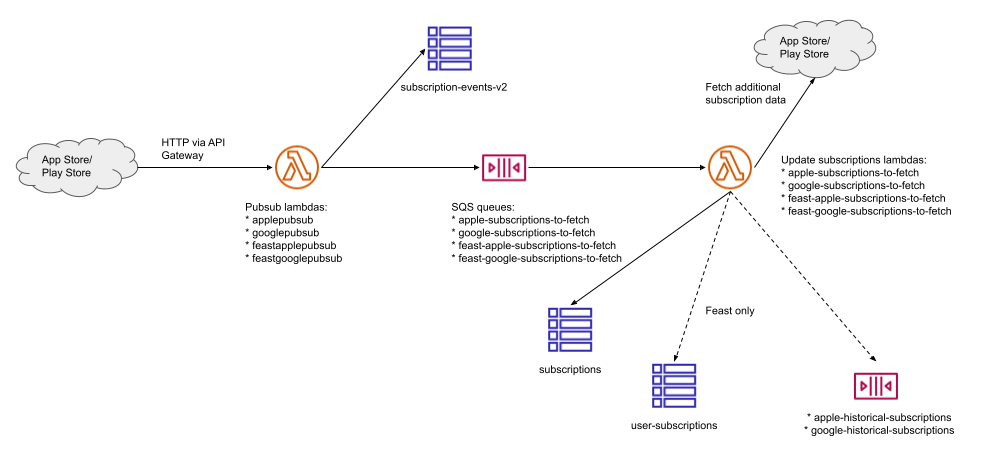

# Mobile Purchases

_IOS and Android receipt validation and purchase persistence_

## Structure of the project

 - The scala part of the project is considered "legacy". It's only kept for very old iOS devices and should be decommissioned once there's only a tiny amount of [traffic reaching the service](https://eu-west-1.console.aws.amazon.com/cloudwatch/home?region=eu-west-1#dashboards:name=MobilePurchases;start=P7D).
 - The Typescript part of the project contains the more modern approach to validating and storing mobile purchases.
 
## Local Setup

### Node

Make sure that you are using the Node version specified by the `.nvmrc` file. We recommend [`fnm`](https://github.com/Schniz/fnm) as the Node version manager.

1. Install `yarn`: `npm install -g yarn`
2. Run `yarn` to install dependencies
3. Run local tests: `yarn test`

### Data

There are three Dynamo DB tables:

 - **Events** (`mobile-purchases-<stage>-subscription-events-v2`): This table records events as they are received from Google and Apple.
 - **Subscriptions** (`mobile-purchases-CODE-subscriptions`): This table records subscriptions held by our users. It contains information such as start date, expiration date, type of subscription and whether it will automatically renew at the end of its validity.
 - **UserSubscriptions** (`mobile-purchases-CODE-user-subscriptions`): This table records the link between a User (as defined by the Guardian) and a subscription.

These tables are exported daily to the datalake.

## Architecture

This service is a set of AWS lambdas, triggered by an API Gateway, SQS queues or Dynamo events. This allow us to scale very efficiently and very cheaply as well as getting retries for free when querying Apple and Google's services. 

### Pubsub

Data enters the system via pubsub endpoints which are called by the Apple App Store and Google Play Store when subscription events happen (e.g. purchase, renewal, cancellation):



This pattern is repeated for the Apple and Google live apps, as well as Feast apps.

In addition to writing to the subscriptions Dynamo table, the Feast lambdas also attempt to link to a user by reading a custom field from the receipt data which is exchanged with Braze for an Identity ID. This is then written to the user-subscriptions table. The live apps do not work this way and the user-subscriptions record is added by the link lambdas (see below).


[Diagram source](https://docs.google.com/drawings/d/1C3-YcIdq4OZBbl5zouHKzJLWgRBtR89yCO9CHCGGkAQ/edit)

### Cloud Functions

 - Link: This is triggered by the Apps if a users is logged-in and has a subscription. The function will store that link in the UserSubscriptions table (after ensuring the user is logged in), and forward the subscription to the Update Subs function.
 - Subscription Status: This is triggered by an API call from the app to check if a Google purchase token or an Apple receipt is a proof to a valid subscription.
 - Update Subs: This function checks the status of a subscription and updates it in the Subscriptions table.
 - Subscription Status: This function checks the status of a subscription on behalf of the App.
 - Delete Link: This function deletes rows from the UserSubscriptions table if their corresponding subscription has been deleted. It relies on [dynamo streams](https://docs.aws.amazon.com/amazondynamodb/latest/developerguide/Streams.html).
  
## Running TypeScript lambdas locally

We're using [TypeScript](https://www.typescriptlang.org/) to develop this project and it's useful to be able to test these locally, without having to resubmit a build and deploy to the cloud. 

To avoid committing test data locally a test-launcher is provided to run a lambda locally, that will only read a file in a directory that's configured to not commit anything.

This can be run locally, and assumes a module with a function `handler` which takes some kind of a payload as a parameter. 

Test a lambda locally by creating a payload json file under the `mobile-purchases-payload` directory and invoke the test-launcher with the name of your lambda module relative to the test-launcher along with the name of a payload file. 

For example, to test the lambda that updates google subscriptions (`typescript/update-subs/google.ts`). This reads from an SQS queue, so create a a file `sqs.json` like this and put it in `mobile-purchases-payload`.


```
{
  "Records": [
    {
      "messageId": "19dd0b57-b21e-4ac1-bd88-01bbb068cb78",
      "receiptHandle": "MessageReceiptHandle",
      "body": "{\"packageName\":\"not-saying\",\"purchaseToken\":\"idontwanttopushthistogithub",\"subscriptionId\":\"keeo-under-wraps\"}",
      "attributes": {
        "ApproximateReceiveCount": "1",
        "SentTimestamp": "1523232000000",
        "SenderId": "123456789012",
        "ApproximateFirstReceiveTimestamp": "1523232000001"
      },
      "messageAttributes": {},
      "md5OfBody": "7b270e59b47ff90a553787216d55d91d",
      "eventSource": "aws:sqs",
      "eventSourceARN": "arn:aws:sqs:eu-west-1:123456789012:MyQueue",
      "awsRegion": "eu-west-1"
    }
  ]
}
```

_This directory has its own `.gitignore` which means that any json files here remain local._

Invoke your function locally via the launcher script thus

```
yarn test-lambda update-subs/google sqs.json
```
