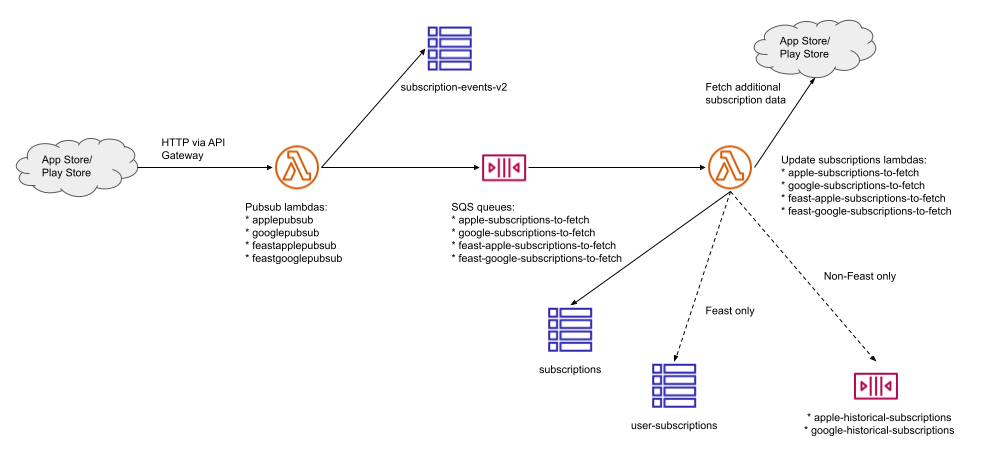
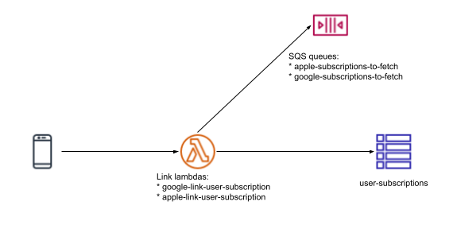
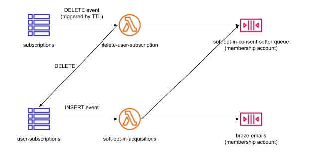

# Architecture

This service is a set of AWS lambdas, triggered by an API Gateway, SQS queues or Dynamo events. This allow us to scale very efficiently and very cheaply as well as getting retries for free when querying Apple and Google's services. 

## Pubsub

Data enters the system via pubsub endpoints which are called by the Apple App Store and Google Play Store when subscription events happen (e.g. purchase, renewal, cancellation):

This pattern is repeated for the Apple and Google live apps, as well as Feast apps.

In addition to writing to the subscriptions Dynamo table, the Feast lambdas also attempt to link to a user by reading a custom field from the receipt data which is exchanged with Braze for an Identity ID. This is then written to the user-subscriptions table. The live apps do not work this way and the user-subscriptions record is added by the link lambdas (see below).

**Note:** Apple subscriptions are revalidated on a schedule by the apple-revalidate-receipts lambda. This lambda reads from the subscriptions Dynamo table and pushes items to the subscriptions-to-fetch SQS queues.

## Linking

The mobile apps link an In App Purchase with a Guardian user by calling the link endpoints. The user must be signed in for this to happen. For the live apps this is the only way users are linked to subscriptions. For Feast, this endpoint is _sometimes_ called as there are cases where the linking cannot happen using the receipt data (e.g. promo codes on iOS).

In some cases the subscription is queued for processing by pushing to the subscriptions-to-fetch SQS queues.

Source architecture diagrams are [here](https://drive.google.com/drive/folders/1D4Fe7kZMc99XBI4woPSmTQIG2ySGd9hl).

[Diagram source](https://docs.google.com/drawings/d/1C3-YcIdq4OZBbl5zouHKzJLWgRBtR89yCO9CHCGGkAQ/edit)

## User & subscription related events

Inserts into the user-subscriptions Dynamo table trigger the soft-opt-in-acquisitions lambda which in turn pushes onto SQS queues in the membership account to set SOI consents and send emails.

Deletions from the subscriptions table (triggered by the TTL being reached) trigger the delete-user-subscription lambda. This severs the user-subscription record for this subscription and pushes onto a queue in the membership account to trigger a recalculation of SOI consents.

