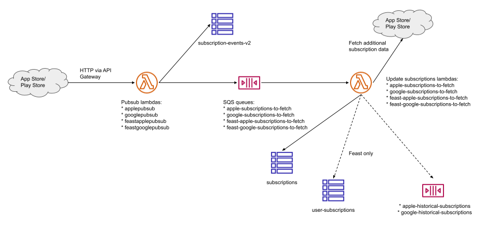

(Nov 2024, originally written as part of the Feast integration)

In this file, we are going to clarify the difference between google purchase tokens and subscriptions ids. For this we are going follow their journey from a HTTP request from the Play Store backend to our DynamoDBs. This documentation is meant to help understanding what is happening and describes the current code. Efforts should be put into keeping it in sync with the code, and if one day a refactoring eliminates some of the effects and problems highlighted here, then do delete this file.

## Google pubsub Part 1

### Initial steps

Here we are following this workflow 



The handler for the google notifications from the Play Store is `src/pubsub/google.ts`

The handler is

```
export async function handler(request: APIGatewayProxyEvent): Promise<APIGatewayProxyResult> {
    return parseStoreAndSend(
        request,
        parsePayload,
        toDynamoEvent,
        toSqsSubReference,
        fetchMetadata
    )
}
```

The `parseStoreAndSend` function essentially constucts a payload for the `subscription-events-v2` table and the SQS queue:

```
const notification = parsePayload(request.body)
const queueUrl = process.env.QueueUrl

const metaData = await fetchMetadata(notification)
const dynamoEvent = toDynamoEvent(notification, metaData)
const dynamoPromise = storeInDynamo(dynamoEvent)
const sqsEvent = toSqsEvent(notification)
const sqsPromise = sendToSqsFunction(queueUrl, sqsEvent)
```

We first build `notification: SubscriptionNotification`, where 

```
{
    version: string
    packageName: string
    eventTimeMillis: string
    subscriptionNotification: {
        version: string,
        notificationType: number,
        purchaseToken: string,
        subscriptionId: string
    }
}
```

Note that a `notification: SubscriptionNotification` has all the data needed to call 

```
fetchGoogleSubscription(subscriptionId: string, purchaseToken: string, packageName: string).
```

Using the notification, we use `fetchMetadata` (which calls `fetchGoogleSubscription`), to return a `GoogleSubscriptionMetaData`

```
interface GoogleSubscriptionMetaData {
    freeTrial: boolean
}
```

### Publishing to subscription-events-v2

To see what goes to the `subscription-events-v2` table, have a look at the function

```
toDynamoEvent(notification: SubscriptionNotification, metaData?: GoogleSubscriptionMetaData): SubscriptionEvent
```

which generates

```
SubscriptionEvent(
    subscriptionId         | notification.subscriptionNotification.purchaseToken # <-- Here is the purchase token!
    timestampAndType       | -
    date                   | -
    timestamp              | -
    eventType              | -
    platform               | -
    appId                  | notification.packageName                            # <-- Here is the package name!
    freeTrial?             | -
    googlePayload          | notification                                        # <-- There subscription Id is in there! (so are the other pieces: purchaseToken and packageName)
    applePayload?          | -
    ttl                    | -
    promotional_offer_id   | -
    promotional_offer_name | -
    product_id             | -
    purchase_date_ms       | -
    expires_date_ms        | -
)
```

That object is put in the table `mobile-purchases-PROD-subscription-events-v2`

### Posting onto the SQS queue

The situation here is simple as we simply take the `SubscriptionNotification` and build a `GoogleSubscriptionReference` 

```
GoogleSubscriptionReference {
    packageName: string
    purchaseToken: string
    subscriptionId: string
}
```

which is then put onto the queue.

## Google pubsub Part 2

Here we are still following the workflow 


but now focusing on populating the two `subscriptions` and `user-subscriptions` Dynamo tables from the second lambda.

### google (classic)

Here we are having a look at `src/update-subs/google.ts`

The work here is done by 

```
record => parseAndStoreSubscriptionUpdate(record, getGoogleSubResponse)
```

Where record carries a `GoogleSubscriptionReference` generated in Part 1.

```
GoogleSubscriptionReference {
    packageName: string,
    purchaseToken: string,
    subscriptionId: string
}
```

Using that information we query for a `GoogleResponseBody`

```
 GoogleResponseBody {
    startTimeMillis: string,
    expiryTimeMillis: string,
    userCancellationTimeMillis: string,
    autoRenewing: boolean,
    paymentState: 0 | 1 | 2 | 3
}
```

and essentially combining the `GoogleSubscriptionReference` and the `GoogleResponseBody` we get a 

```
Subscription(
    subscriptionId        | purchaseToken                                         # <-- Here is the purchase token!
    startTimestamp        | -
    endTimestamp          | -
    cancellationTimestamp | -
    autoRenewing          | -
    productId             | subscriptionId                                        # <-- Here is the subscriptionId
    platform              | googlePackageNameToPlatform(packageName)?.toString()  # package name is now visible as platform
    freeTrial             | -
    billingPeriod         | -
    googlePayload         | -
    receipt               | -
    applePayload          | -
    ttl                   | -
)
```

We have now clarified the source of the data that goes into the `subscriptions` table, at least in the case of google subscriptions. And note the indiosyncrasy that the subscription identifier is carried by the `productId` attribute and the purchase token is carried by the `subscriptionId` attribute.

### google (feast variant)

Here we are having a look at `src/feast/update-subs/google.ts`

In this case we populate both the `subscriptions` table and the `user-subscriptions` tables.

To populate the `subscriptions` table we build the following subscription (where, as above, we indicate, the locations of the purchase token, the subscription identifier and the platform)

```
Subscription(
    subscriptionId        | purchaseToken                            # <-- Here is the purchase token!
    startTimestamp        | -
    endTimestamp          | -
    cancellationTimestamp | -
    autoRenewing          | -
    productId             | googleSubscription.productId
    platform              | googlePackageNameToPlatform(packageName) # package name is now visible as platform
    freeTrial             | -
    billingPeriod         | -
    googlePayload         | -
    receipt               | -
    applePayload          | -
    ttl                   | -
)
```

Note that this subscription is more "correct", in the sense that the `productId` attribute is now a product identifier, but we have lost the subscription identifier. This means that in the classic case, using the information from a subscription, we could recover the information needed to call `fetchGoogleSubscription`, but in the feast variant case, that's not possible.

To populate the user-subscriptions table, we build a `UserSubscription` with the following line

```
userSubscription = new UserSubscription(identityId, subscription.subscriptionId, new Date().toISOString())
```

Interestingly the `subscription` that we use the `subscriptionId` of is the subscription that we built above, and among other things the subscriptionId is a purchase token. This means that the `UserSubscription` we are buildling

```
UserSubscription {
    userId: string
    subscriptionId: string      # <-- Here is the purchase token!
    creationTimestamp: string
```

has a `subscriptionId` field that is equal to the purchase token of the corresponding feast subscription.

In total there is a net loss of information that occurred when the feast variant of the google pubsub code was written, and we have lost the subscription identifier.

nb: This file describes the code as the time these lines are written but we are going to do the work of recording and recovering that information in a coming PR.
